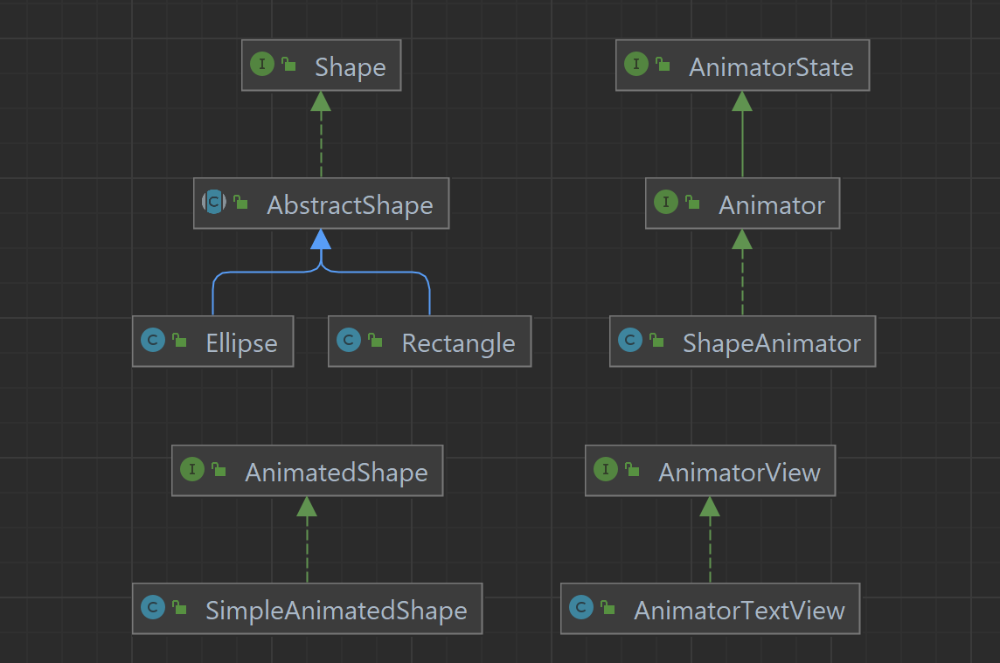

# model.Animator Project
 
<h3>Overview of Design</h3>

The main feature of this project is the model model.Animator interface 
implemented by the model.ShapeAnimator class. model.Animator has the functionality
to Add and remove shapes to the animation, and add and remove motions
of these shapes over time.

This is done by using the model.AnimatedShape interface as a representation
of a single shape and all of its movements throughout the animation.
Each model.AnimatedShape contains Shapes which are representations of
a shape at one point in time as well as motions which are the
interactions between these Shapes.

Each model.Shape has a position, width, height, and a color.

This project also contains a AnimationView that is implemented
as a text model which displays all shapes in the animation and
their motions.

<h3>Structure</h3>

<h3>Classes Overview for the model</h3>

model.Shape: Interface to represent a shape that has a position, width,
height, and color. This is meant to be immutable and hold 
information solely for a shape at one point in time in the animation.

model.AbstractShape: Abstract implementation of model.Shape that simply holds
variables for position, width, height, and color and implements
basic shape functions.

model.Rectangle & model.Ellipse: Concrete implementations of model.AbstractShape
that currently have no difference than name and model.ShapeType.

model.AnimatorState: This is a state representation of the model that
only has the ability to get information about an animation, not 
mutate. This is used by the model.

model.Animator: Extension of the model.AnimatorState that adds the ability
to modify and add shapes and motions to the animation as described
in the documentation.

model.ShapeAnimator: Implementation of model.Animator which uses AnimatedShapes and 
ShapeID strings in key value pairs to hold information about the shapes.

model.AnimatedShape: Represents a specific shape throughout an animation.

model.SimpleAnimatedShape: Implementation of model.AnimatedShape.

model.Color: Representation of a color with red, green, and blue values.

model.Position: Representation of a position on a canvas with an x and y
value.

model.Motion: Representation of a motion of a shape that has a start time, 
and end time, and an end shape. Throughout the motion, the shape will
continuously transform to the end shape. 

model.ShapeType: Enum which represents the types of shapes that can be
made in the animation. Currently, this only holds model.Rectangle and model.Ellipse.

io.AnimationRunner: Class with a main method used for manual testing.

model.Utility: class with static methods that are generally useful
throughout the program.

<h3>Classes Overview for the Views</h3>

view.AnimatorView: Interface to model the model with a render method.

view.AnimatorTextView: Implementation of view.AnimatorView that uses text
to display a representation of an animation.

view.SVGView: Implementation of view.AnimatorView that uses SVG
to display an animation. Can be saved to an SVG file 
to be run as an animation

view.SwingView:

view.SwingPanel:

