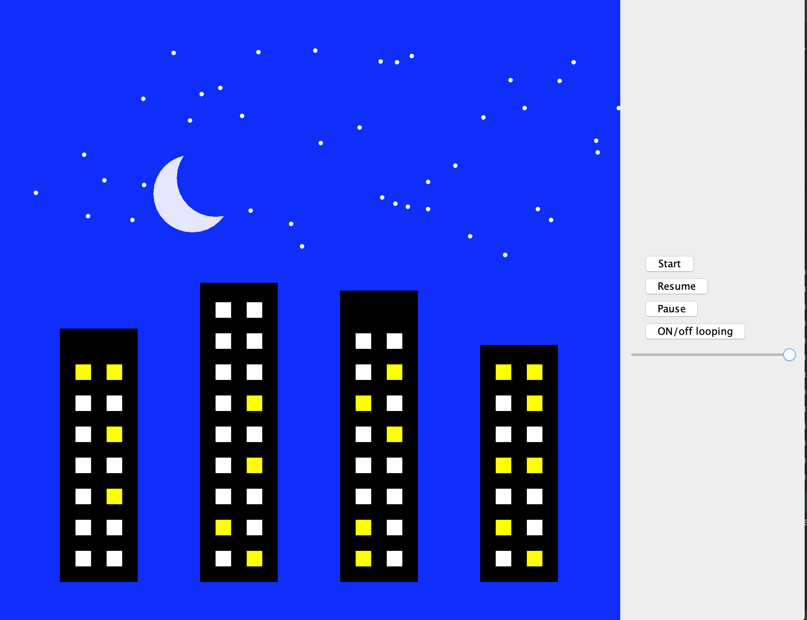

# model.Animator Project
  
<h3>Overview of Design</h3>
 
The main feature of this project is the model model.Animator interface 
implemented by the model.ShapeAnimator class. model.Animator has the functionality
to add and remove shapes to the animation, and add and remove motions
of these shapes over time.

This is done by using the model.AnimatedShape interface as a representation
of a single shape and all of its movements throughout the animation.
Each model.AnimatedShape contains Shapes which are representations of
a shape at one point in time as well as motions which are the
interactions between these Shapes.

Each model.Shape has a position, width, height, and a color.

This project also contains a AnimationView that is implemented
as a text view, a SVG view, and a Swing view. Each of the views are visual 
representations of the animation. 

<h3>Overview of io</h3>
The io of our program takes in up to 4 parameters from main: speed, 
input, output, and viewType. As of now, the main method just creates a constructor with its 
given arguments. When created, the controller class processes these by first creating 
the correct View implementation using the ViewFactory class based on viewType, then 
the method processes the input file with a TweenModelBuilder to initialize our animatior.
Then this animator and the tickrate are then passed into the view along with the given output.
Lastly, the render method is called and the view begins to output. The controller also handles 
user input from the view through ActionListeners and ChangeListener.

<h3>Structure</h3>
<h2>Shape diagram:</h2>

<h2>Animator diagram:</h2>

<h2>View diagram:</h2>

<h2>Animated Shape diagram:</h2>

<h3>Classes Overview for the model</h3>

model.Shape: Interface to represent a shape that has a Position, width,
height, and Color. This is meant to be immutable and hold 
information solely for a shape at one point in time in the animation.

model.AbstractShape: Abstract implementation of model.Shape that simply holds
variables for position, width, height, and color and implements
basic shape functions.

model.Rectangle & model.Ellipse: Concrete implementations of model.AbstractShape
that currently have no difference than name and model.ShapeType.

model.Position: Representation of a position on a canvas with an x and y
value.

model.Color: Representation of a color with red, green, and blue values.

model.AnimatorState: This is a state representation of the model that
only has the ability to get information about an animation, not 
mutate. This is used by the model.

model.Animator: Extension of the model.AnimatorState that adds the ability
to modify and add shapes and motions to the animation as described
in the documentation.

model.ShapeAnimator: Implementation of model.Animator which uses AnimatedShapes and 
ShapeID strings in key value pairs to hold information about the shapes.

model.AnimatedShape: Represents a specific shape throughout an animation.

model.SimpleAnimatedShape: Implementation of model.AnimatedShape.

model.Motion: Representation of a motion of a shape that has a start time, 
and end time, and an end shape. Throughout the motion, the shape will
continuously transform to the end shape. 

model.ShapeType: Enum which represents the types of shapes that can be
made in the animation. Currently, this only holds model.Rectangle and model.Ellipse.

model.Utility: class with static methods that are generally useful
throughout the program.

model.BubbleSortCreator: Creates an animation that displays a visual representation 
of the bubble sort algorithm.

model.PlanetCreator: Creates an animation that displays a visual representation
of planets orbiting the sun.

<h3>Classes Overview for the Views</h3>

view.AnimatorView: Interface to model the model with a render method.

view.AnimatorTextView: Implementation of view.AnimatorView that uses text
to display a representation of an animation.

view.SVGView: Implementation of view.AnimatorView that uses SVG
to display an animation. Can be saved to an SVG file 
to be run as an animation

view.SwingView: Implementation of the view.AnimatorView interface 
and uses Java Swing's JFrame class to visually display the animation. 

view.SwingPanel: Extension of the Java Swing's JPanel class that handles the actual 
construction of the animation onto the SwingView.

view.CompositeView: Represents a AnimatorView which has added functionality to pause, resume, and 
toggle whether an animation loops after completion.

view.CompositeViewImpl: An implementation of the CompositeView interface which has added Swing 
components which are used to pause, resume, and toggle whether an animation loops after completion.

<h3>Classes Overview for the Input classes and Model Builders</h3>

io.AnimationFileReader: This class represents a file reader for the animation file. 
This reads in the file in the prescribed file format, and relies on a model 
builder interface.

io.AnimationRunner: Class with a main method used for manual testing and 
running command-line arguments for running certain commands to input and handle the output.

io.TweenModelBuilder: This interface contains all the methods that the io.AnimationFileReader class 
calls as it reads a file containing the animation and builds a model. It is 
parameterized over the actual model type. One important detail about our TweenModelBuilder is
that our Animation only stores one type of Motion which represents all three types of changes (
position, color, scale) at once. Thus, our TweenModelBuilder has to do extra computations to combine
each of these types of motions into one before building. 

io.TweenBuilderImpl: Implementation of the TweenModelBuilder interface that creates an animation of type Animator 
from a file.

io.AnimationController: The controller class processes given inputs by first creating
the correct View implementation using the ViewFactory class based on viewType, then
the method processes the input file with a TweenModelBuilder to initialize our animatior.
Then this animator and the tickrate are then passed into the view along with the given output.
Lastly, the render method is called and the view begins to output. The controller also handles
user input from the view through ActionListeners and ChangeListener.

<H3>Modifications to our earlier code from our last assignment:</H3>

We updated the main method to include our interactive view.

We added playback methods to our Swing Panel class that are used by the controller. 

<<<<<<< HEAD
=======

>>>>>>> parent of 484636e (Final changes)
Buildings animation with our interactive view.
